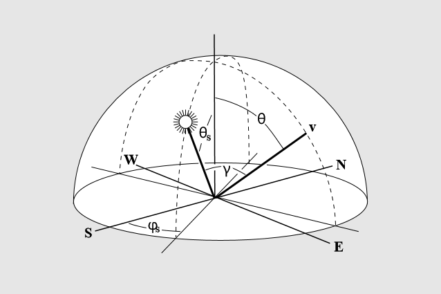
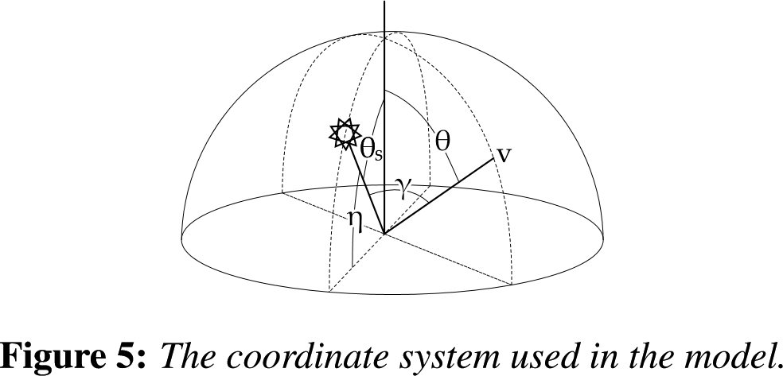
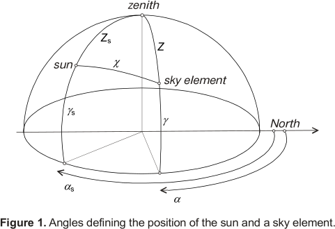
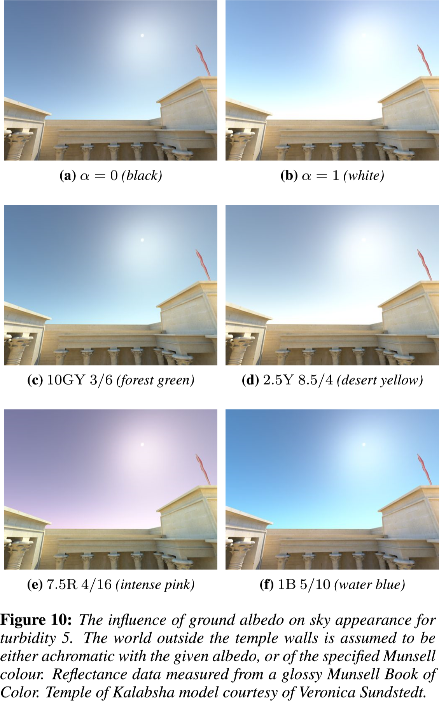
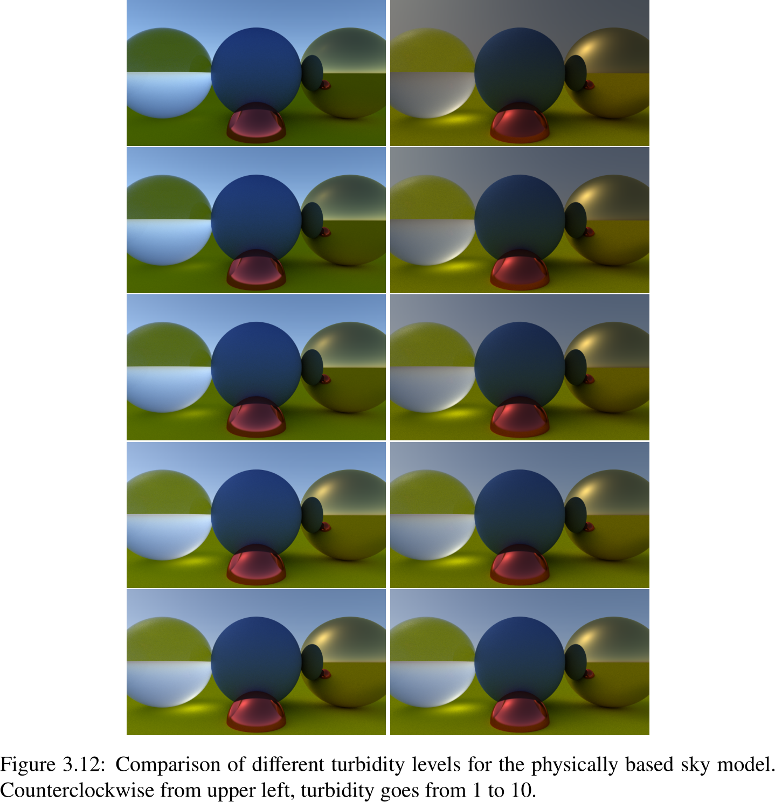

% Miss Shaders and Sky Models
% CS 481/681 Computer Graphics Rendering
% University of Alaska Fairbanks

## Project Pitch

- Exciting Ideas
- Realtime Ray Tracing
- Virtual Reality Experiences
- Comparing Renderer Results
- Applying Machine Learning to CG

## Miss Shaders and Sky Models

- Ray Tracing Pipeline
- Miss Shaders
- Sky Models
- Astronomical Calculations

## Ray Tracing Pipeline

- Ray Generation
- Ray Traversal Acceleration Structure
- Intersection Shader
- Any Hit Shader
- Miss Shader
- Closest Hit Shader

## Ray Tracing Pipeline

<!--
digraph G {
  subgraph cluster2 {
  "Acceleration\nStructure\nTraversal" -> "Intersection\nShader";
  "Intersection\nShader" -> "Any Hit\nShader";
  "Any Hit\nShader" -> "Acceleration\nStructure\nTraversal";
  }
  

  "Ray Generation" -> "Acceleration\nStructure\nTraversal" [label="Trace Ray"];
  "Acceleration\nStructure\nTraversal" -> "Hit?";
  "Hit?" -> "Closest Hit\nShader" [label="Yes"];
  "Hit?" -> "Miss Shader" [label="No"];

  "Intersection\nShader" [shape=rectangle];
  "Closest Hit\nShader" [shape=rectangle];
  "Any Hit\nShader" [shape=rectangle];
  "Miss Shader" [shape=rectangle];
}-->

## Miss Shaders

- If we have no hits, we need to do something
- A good candidate is a sky model
- What about the ground?

## Sky Models

- CIE Clear Sky and Overcast Sky
- [Preetham et al. (1999)](https://www.cs.utah.edu/~shirley/papers/sunsky/sunsky.pdf)
- [Hosek-Wilkie (2012)](https://cgg.mff.cuni.cz/projects/SkylightModelling/HosekWilkie_SkylightModel_SIGGRAPH2012_Preprint_lowres.pdf)
- [Bruneton-Neyret (2008)](http://www-ljk.imag.fr/Publications/Basilic/com.lmc.publi.PUBLI_Article@11e7cdda2f7_f64b69/article.pdf)
- [DIHARAW's port](https://github.com/diharaw/AtmosphericScattering)

## Preetham et al Frame of Reference

## Hosek-Wilkie Frame of Reference

## CIE Model Frame of Reference

## Parameters

- Turbidity $T$
- Ground Albedo $\alpha$
- Sun inclination or declination?
- Gamma $\gamma$ is measurement from sky position to sun position
- Think about it: which way is north or west?

## Ground Albedo

## Turbidity

## Astronomical Calculations

- Video: [Carla's Island (1981)](https://youtu.be/kO-JB1WHmRc)
- Video: [NASA Voyager 2 Flyby (1981)](https://www.youtube.com/watch?v=SQk7AFe13CY)
- Use astronomical calculations to determine animation parameters

## Implementation

- Example 6

## Hybrid Topics and Activity Worksheet

- Any Hit Shaders and Shadows