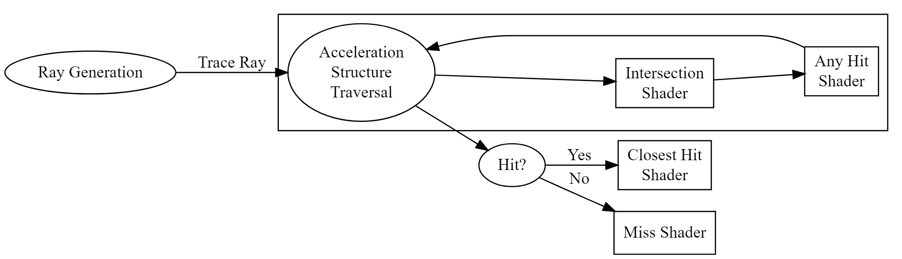
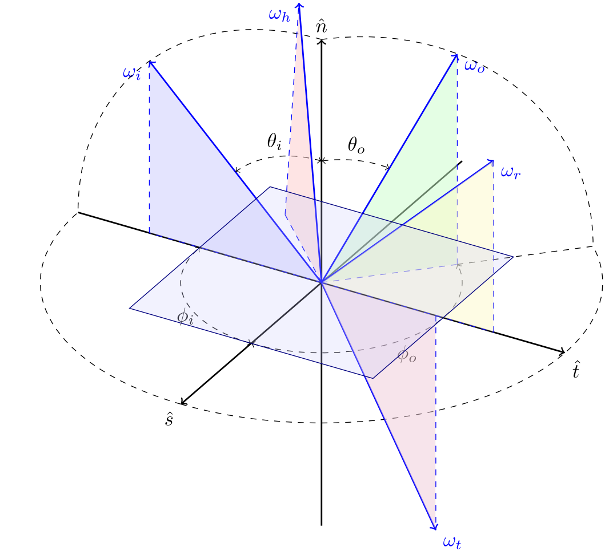

% Closest Hit Shaders & BRDFs
% CS 481/681 Computer Graphics Rendering
% University of Alaska Fairbanks

## Overview

- Review the Ray Tracing Pipeline

## Ray Tracing Pipeline

## Closest Hit Shaders

- Reflection
- Refraction
- Shadow Rays

## Bidirectional Reflectance Distribution Functions

- Specular
  - Phong
  - Blinn-Phong
  - Cook-Torrance
  - GGX
- Diffuse
  - Lambert's cosine law ($N \cdot L$)
  - Oren-Nayer
  - Disney Diffuse BRDF

## Frame of Reference

- Geometric normal: $N$ -- $\omega_g$
- View direction: $V$ -- $\omega_o$
- Light direction: $L$ -- $\omega_i$
- Hemisphere: $\Omega$
- Half-angle vector: $H$ -- $\omega_h$
- Reflection vector: $R$ -- $\omega_r$
- Refraction vector: $T$ -- $\omega_t$

## The Rendering Equation

- [Nicodemus 1965] $f_r(\omega_{i},\omega_{o}) = \frac{\operatorname dL_{o}(\omega_{o})}{\operatorname dE_{i}(\omega_{i})} \,=\, \frac{\operatorname dL_{o}(\omega_{o})}{L_{i}(\omega_{i})\cos\theta_{i}\,\operatorname d\omega_{i}}$
- [Kajiya 1986]

$$
L_o (\mathbf{x} \to \omega_o) = L_e(\mathbf{x} \to \omega_o) + \int_\Omega f_r(\omega_i, \omega_o)\ L_i(\omega_i \to \mathbf{x})\ \langle \omega_i, \omega_o \rangle \ d\omega_i
$$

## Paul Heckberts' Notation

- $E$ is eye
- $L$ is vector
- $S$ is specular interface
- $D$ is diffuse interface
- $LSE$ path is light-specular-eye path
- $L\lbrace SD \rbrace E$ path is light to a *single* specular/diffuse interface to eye
- $L\lbrace SD \rbrace ^+E$ path is light to *several* specular/diffuse interfaces to eye

## Physically Based BRDFs

- Conservation of Energy

$$\int_{\Omega} f_r(\omega_i, \omega)\ d\omega_i \le 1$$

- Helmholtz Reciprocity

$$f_r(\omega_i, \omega_o) = f_r(\omega_o, \omega_i)$$

- Positivity

$$f_r(\omega_i, \omega_o) \ge 0$$

- Conservation of visible projected area

$$\cos \theta_o = \int_\Omega G_1(\omega_o, \omega) \langle \omega_o, \omega \rangle D(\omega) d\omega$$

## Diffuse BRDFs

- Lambertian $f_r = \frac{\rho}{\pi}$
- Oren-Nayer

$$\begin{aligned} f_r =& \frac{\rho}{\pi} (A + (B \cdot \max \left[ 0, \cos(\phi_i - \phi_o)\right] \cdot \sin \alpha \cdot \tan \beta)) \\ A=&1-0.5\frac{\sigma^2}{\sigma^2 + 0.33} \\ B =& 0.45 \frac{\sigma^2}{\sigma^2 + 0.09} \\ \alpha =& \max (\theta_i, \theta_o) \\ \beta =& \min (\theta_i, \theta_o) \end{aligned}$$

## Specular BRDFs

- [Cook-Torrance 1981] $f_r (\omega_i, \omega_o) = \frac{D(\omega_h)\ F(\theta_d)\ G_2(\omega_i, \omega_o)}{4 \cos{\theta_i} \cos{\theta_o}}$
- Microfacet Distribution
  - Normalized Blinn-Phong: $D_{\mathsf{BP}}(\omega_g, \omega_h) = \frac{1}{\pi \alpha^2} (\omega_g \cdot \omega_h)^{\tfrac{2}{\alpha^2+\epsilon} - (2+\epsilon)}$
  - GGX: $D_{\mathsf{GTR}}(\omega_g, \omega_h) = \frac{1}{\pi} {\left( \frac{1}{(\alpha^2 - 1) (\omega_g \cdot \omega_h)^2 +1} \right)}^\gamma$

## Masking-Shadowing Function

- $G_2(\omega_i, \omega_o, \omega_g) = \frac{1}{1 + \Lambda(\omega_i) + \Lambda(\omega_o)}$
- GGX: $\Lambda(\omega) = \frac{-1 + \sqrt{1 + \frac{(\omega_g \cdot \omega)^2}{\alpha^2(1-(\omega_g \cdot \omega)^2)}}}{2}$
- Blinn-Phong: $G_2 (\omega_i, \omega_o, \omega_g) = \min \left \{ 1 , \tfrac{(\omega_g \cdot \omega_h) (\omega_g \cdot \omega_o)}{\omega_o \cdot \omega_h} , \tfrac{(\omega_g \cdot \omega_h) (\omega_g \cdot \omega_i)}{\omega_o \cdot \omega_h} \right \}$

## Fresnel

- [Schlick 1995] $F(\theta_d) = F_0 + (1 - F_0)(1 - \cos^5{\theta_d})$
- $F = \frac{\rho^2_{\parallel} + \rho^2_\perp}{2}$
- $\rho^2_\parallel = \frac{(\eta_2^2 + \kappa_2^2) \cos^2 \theta_d - 2 \eta_2 \cos \theta_d + 1}{(\eta_2^2 + \kappa_2^2) \cos^2 \theta_d + 2 \eta_2 \cos \theta_d + 1}$
- $\rho^2_\perp     = \frac{(\eta_2^2 + \kappa_2^2) - 2 \eta_2 \cos \theta_d + \cos^2 \theta_d}{(\eta_2^2 + \kappa_2^2) + 2 \eta_2 \cos \theta_d + \cos^2 \theta_d}$

## Hybrid Topics and Activity Worksheet

- Global Illumination
- Spherical Harmonics