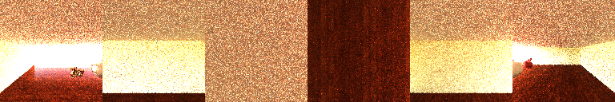
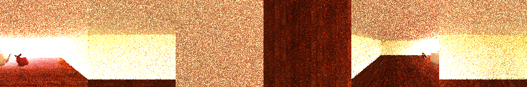
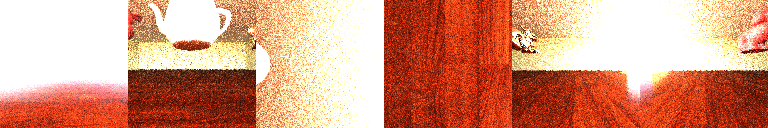
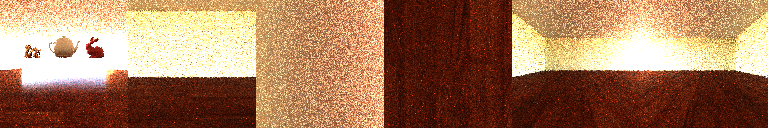

% Global Illumination
% CS 481/681 Computer Graphics Rendering
% University of Alaska Fairbanks

## Overview

- Specular BRDFs
- Global Illumination
- Regular Expression Notation
- Path Tracing and Radiosity
- Global Illumination Techniques
- Spherical Harmonics

## Midterm Procedures

- Will be posted on Thursday by 9am
- You have 48 hours to complete the exam
- It is due before 9am on Saturday morning
- Late submissions are automatically a zero, sorry
- Write your submissions in Latex by filling in the template on Overleaf
- Submit the PDF

## Midterm Resources

- Whitted 1980 [An Improved Illumination Model for Shaded Display](http://www.cs.drexel.edu/~david/Classes/CS586/Papers/p343-whitted.pdf)
- Cook and Torrance 1982 [A Reflectance Model for Computer Graphics](https://inst.cs.berkeley.edu/~cs283/sp13/lectures/cookpaper.pdf)
- Kajiya 1986 [The Rendering Equation](http://www.cse.chalmers.se/edu/year/2016/course/TDA361/rend_eq.pdf)
- Hart et al 1989 [Ray Tracing Deterministic 3-D Fractals](https://dl.acm.org/citation.cfm?id=74363)
- John C. Hart 1996 [Sphere tracing: a geometric method for the antialiased ray tracing of implicit surfaces](http://citeseerx.ist.psu.edu/viewdoc/download?doi=10.1.1.87.339&rep=rep1&type=pdf)
- Cook et al 1984 [Distributed ray tracing](http://cseweb.ucsd.edu/~viscomp/classes/cse274/fa18/readings/distribution.pdf)
- Blinn and Newell 1976 [Texture and Reflection in Computer Generated Images](http://papers.cumincad.org/data/works/att/186e.content.pdf)
- Veach and Guibas 1995 [Optimally combining sampling techniques for Monte Carlo rendering](http://sites.fas.harvard.edu/~cs278/papers/veach.pdf)
- Erik Lindholm et al 2001 [A User-Programmable Vertex Engine](https://www.researchgate.net/profile/Henry_Moreton/publication/220720178_A_User-Programmable_Vertex_Engine/links/00463533c5fff145d7000000.pdf)
- Heckbert 1990 [Adaptive Radiosity Textures for Bidirectional Ray Tracing](http://citeseerx.ist.psu.edu/viewdoc/download?doi=10.1.1.84.4862&rep=rep1&type=pdf)
- Heitz 2014 [Understanding the Masking-Shadowing Function in Microfacet-Based BRDFs](https://hal.inria.fr/hal-01024289/document)
- Hosek & Wilkie 2012 [An analytic model for full spectral sky-dome radiance](http://citeseerx.ist.psu.edu/viewdoc/download?doi=10.1.1.370.9449&rep=rep1&type=pdf)
- Jarosz et al 2008 [Radiance Caching for Participating Media](https://cs.dartmouth.edu/~wjarosz/publications/jarosz08radiance.pdf)

## Regular Expression Notation

- $E$ is eye
- $L$ is vector
- $S$ is specular interface
- $D$ is diffuse interface
- $LSE$ path is light-specular-eye path
- $L\lbrace SD \rbrace E$ path is light to a *single* specular/diffuse interface to eye
- $L\lbrace SD \rbrace ^+E$ path is light to *several* specular/diffuse interfaces to eye

## Path Tracing and Radiosity

- Path Tracing
  - Shoot Ray. Hit.
  - Shoot Ray in random direction. Hit.
  - If a light, then evaluate light path
  - Typically, we just average the results obtained to within a certain path depth
- Radiosity
  - Divide scene into patches.
  - Determine each patch's contribution to each other
  - Calculate transport of light from patch to patch
  - We stop after converging on answer

## Global Illumination Techniques

- Photon Mapping
- Bidirectional Path Tracing
- Instant Radiosity
- Voxel Cone Tracing
- Photon Mapping
- Multiple Importance Sampling

## Spherical Harmonics

- Orthogonal vectors: $\mathbf{u} \cdot \mathbf{v} = 0$
- *Function spaces* $\langle f, g \rangle = \int \overline{f(x)} g(x) dx$
- Orthogonal functions: $\langle f, g \rangle = 0$ if $f \ne g$
- These can be used to approximate other functions
- e.g. Fourier Series
  - $f: \mathbb{R} \to \mathbb{R}$
  - $a_0 = \frac{1}{\pi} \int^{\pi}_{-\pi} f(t)\ dt$
  - $a_n = \frac{1}{\pi} \int^{\pi}_{-\pi} f(t)\ \cos(nt)\ dt$
  - $b_n = \frac{1}{\pi} \int^{\pi}_{-\pi} f(t)\ \sin(nt)\ dt$
  - $f \sim \frac{1}{2} a_0 + \sum^{\infty}_{n=1} [a_n \cos (nt) + b_n \sin(nt)]$
- This works for 2D functions, if only we had something for spheres...

## Legendre Polynomials

- Orthogonal function discovered by Adrien-Marie Legendre in 1782
- Rodrigues' formula: $P_{\ell}(x) = \frac{1}{2^n n!} \frac{d^n}{dx^n} (x^2 - 1)^n$
- First few are $1, x, \tfrac{1}{2}(3x^2 - 1), \tfrac{1}{2}(5x^3-3x), \ldots$
- Recursive definition
  - $(\ell - m)P^m_{\ell} = x(2\ell - 1)P^m_{\ell - 1} - (\ell + m - 1)P^m_{\ell - 2}$
  - $P^m_m = (-1)^m (2m - 1)!!(1 - x^2)^{m/2}$
  - $P^m_{m+1} = x(2m + 1)P^m_m$
- Need one more step to solve Laplace's equation in spherical coordinates
- Associated Legendre Polynomials $P^m_{\ell}(x)$
  - $P^m_{\ell}(x) = (-1)^m(1-x^2)^{m/2} \frac{d^m}{dx^m(P_{\ell}(x))}$
  - Orthogonal: $\int P^m_{k} P^m_{\ell} = \frac{2(\ell+m)!}{(2\ell+1)(\ell-m)} \delta_{k,\ell}$
  - $-m$: $P^{-m}_{\ell} = (-1)^m \frac{(\ell - m)!}{(\ell + m)!} P^m_{\ell}(x)$
- These are the tools for Spherical Harmonics

## Spherical Harmonics

- A set of orthogonal functions on the sphere
- This is an excellent way to represent low-frequency environment maps
- $Y^m_{\ell}(\theta, \varphi)$ is Laplace's spherical harmonics
- Approximating $f(\theta, \varphi)$
  - degree $\ell$ and order $m$: $\ell(\ell+1)$ coefficients (e.g. $n^2$)
  - $Y^m_{\ell}(\theta, \varphi) = N e^{im\varphi} P^m_{\ell}(\cos \theta)$
  - $a^m_{\ell} = \int f(\theta, \varphi)\ Y^m_{\ell}(\cos \theta)$
  - $f(\theta, \varphi) \sim \sum^{\infty}_{\ell=0} \sum^{\ell}_{m=-\ell} a^m_{\ell} Y^m_{\ell}(\cos \theta)$

## Real Spherical Harmonics

- Notice the $e^{im\varphi}$: uh oh, imaginary numbers
- Let's do this with real numbers

$$
\begin{aligned}
Y^m_{\ell} =&
    \begin{cases}
    \sqrt{2} K^m_{\ell} \cos(m\varphi) P^m_{\ell}(\cos \theta) & m > 0 \\
    \sqrt{2} K^m_{\ell} \sin(-m\varphi) P^{-m}_{\ell}(\cos \theta) & m < 0 \\
    K^0_{\ell} P^0_{\ell}(\cos \theta) & m = 0
    \end{cases} \\
K^m_{\ell} =& \sqrt{\frac{2\ell + 1}{4\pi} \frac{(l-|m|)!}{(l+|m|)!}}
\end{aligned}
$$

- Spherical coordinates $\begin{bmatrix} \sin \theta \cos \varphi & \sin \theta \sin \varphi & \cos \theta \end{bmatrix}^T = \begin{bmatrix} x & y & z \end{bmatrix}^T$
- How to calculate $a^m_{\ell}$?

$$
a^m_{\ell} = \int^{2\pi}_{0} \int^{\pi}_{0} f(\theta, \varphi) Y^m_{\ell}(\theta, \varphi) \sin \theta d\varphi d\theta
$$

## Monte Carlo Estimator

- $\int_{\Omega} g\ d\omega \approx \frac{1}{N} \sum^N_{j=1} g(x_j) w(x_j)$
- $a^m_{\ell} = \frac{p(\omega)}{N} \sum^N_{j=1} f(\theta, \varphi)\ Y^m_{\ell}(\theta, \varphi) \frac{1}{p(\omega)}$
- Since $p(\omega)$ is constant, or $4\pi$, we can move it outside the sum
- Process
  - Take high resolution environment map
  - Pick several samples from it
  - Create coefficients using Monte Carlo
  - In our shader, use our coefficients to recalculate the image
  - Now, we have band limited shading!

## Global Illumination

- Greger et al 1998 [The Irradiance Volume](http://sites.fas.harvard.edu/~cs278/papers/pmap.pdf)
- Ramamoorthi and Hanrahan 2001 [An Efficient Representation for Irradiance Environment Maps](http://www.cs.virginia.edu/~jdl/bib/envmap/representation/ramamoorthi01.pdf)
- Sloan et al 2002 [Precomputed radiance transfer for real-time rendering in dynamic, low-frequency lighting environments](http://cseweb.ucsd.edu/~ravir/6998/papers/p527-sloan.pdf)
- Robin Green 2003 [Spherical Harmonic Lighting: The Gritty Details](http://silviojemma.com/public/papers/lighting/spherical-harmonic-lighting.pdf)

## SPH

## Hybrid Topics

- None this week because ...
- Time Reserved for Midterm Exam
