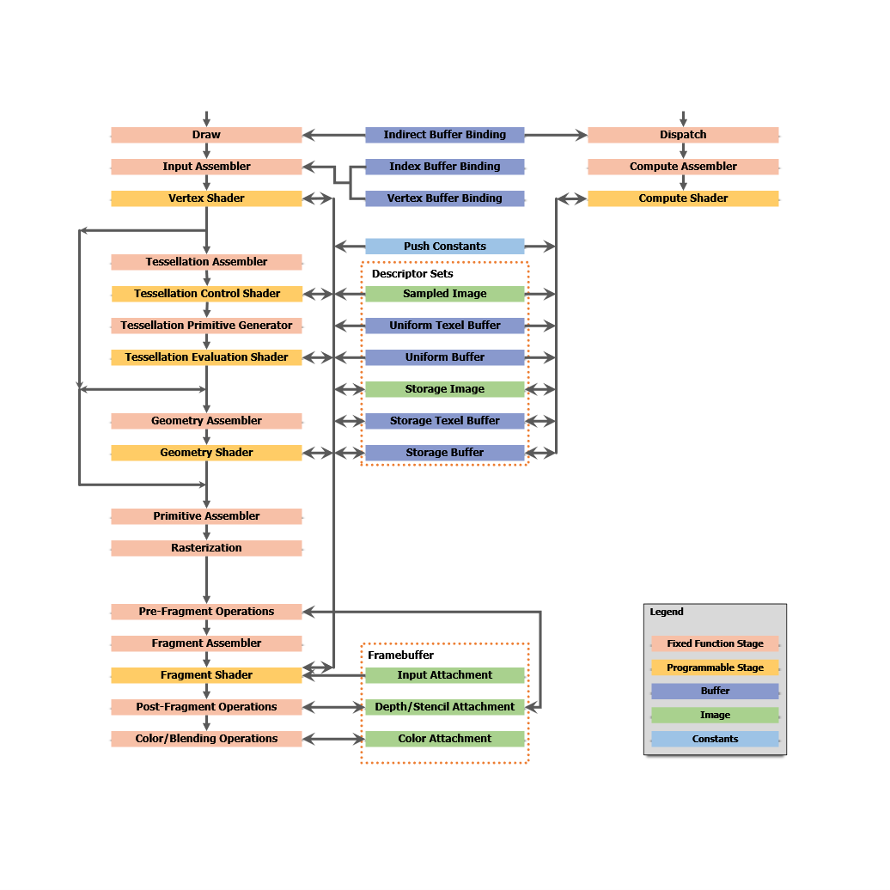

% Realtime Rendering
% CS 481/681 Computer Graphics Rendering
% University of Alaska Fairbanks

## Overview

- Reyes Architecture
- Shade Trees

## Reyes Architecture

- Cook, Carpenter, Catmull 1987
- Pixar Renderman
- An Architecture
- Micropolygons
- Visibility
- Programmable Shaders
- Motivation: Speed
  - Rendering a 2 hour movie in one year
  - 3 minutes per frame

## Reyes Flowchart

## Shade Trees

- Cook 1984

## Questions

- What are advantages / disadvantages?
- What are micropolygons?
- Why use shaders?

## Comparison

